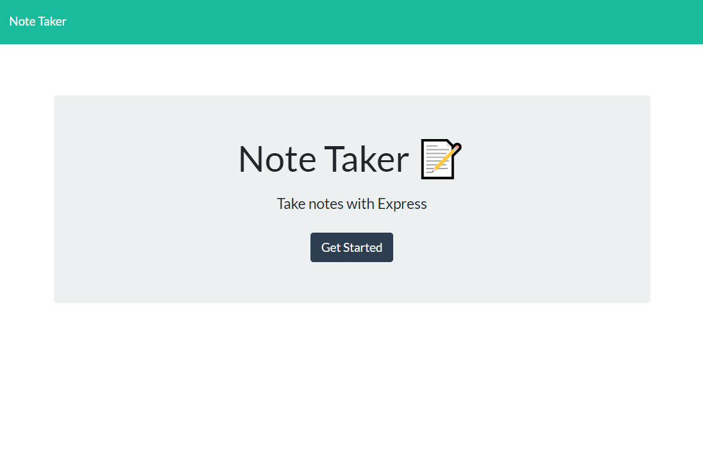
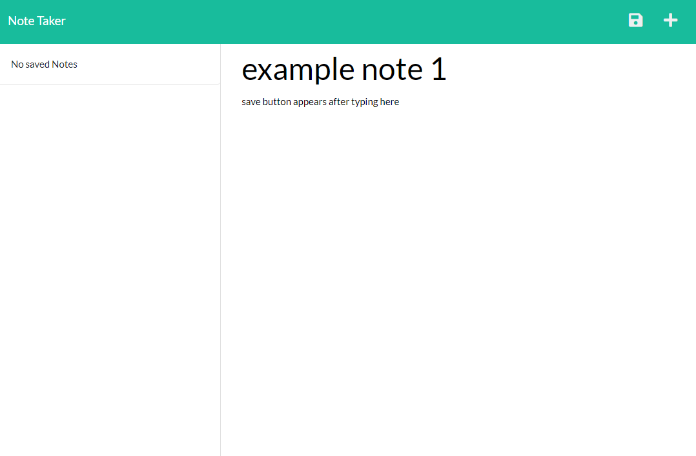

# My Note Taker, a note taking app

## Description

My Note Taker is an app that you can use to easily create, save, and delete notes. 

## Site Preview





Deployed here

## User Story

```
AS A small business owner
I WANT to be able to write and save notes
SO THAT I can organize my thoughts and keep track of tasks I need to complete
```

## Acceptance Criteria

```
GIVEN a note-taking application
WHEN I open the Note Taker
THEN I am presented with a landing page with a link to a notes page
WHEN I click on the link to the notes page
THEN I am presented with a page with existing notes listed in the left-hand column, plus empty fields to enter a new note title and the note’s text in the right-hand column
WHEN I enter a new note title and the note’s text
THEN a Save icon appears in the navigation at the top of the page
WHEN I click on the Save icon
THEN the new note I have entered is saved and appears in the left-hand column with the other existing notes
WHEN I click on an existing note in the list in the left-hand column
THEN that note appears in the right-hand column
WHEN I click on the Write icon in the navigation at the top of the page
THEN I am presented with empty fields to enter a new note title and the note’s text in the right-hand column
```

## Installaion

Clone the repo and use the following commands to get started:

```
npm i
```

To test how the app is running, use this command
```
node server
```

and then follow the link to see how it looks in your web browser

## Tech used

* Node.js
* Express.js
* [uuid](https://www.npmjs.com/package/uuid) - npm
* [Heroku](https://www.heroku.com/) to deploy the site

## License

This project is licensed under the [MIT License](https://github.com/s-s-lee/my-note-taker/blob/main/LICENSE).

## Contact

Contact [Susan](https://github.com/s-s-lee) for any questions.